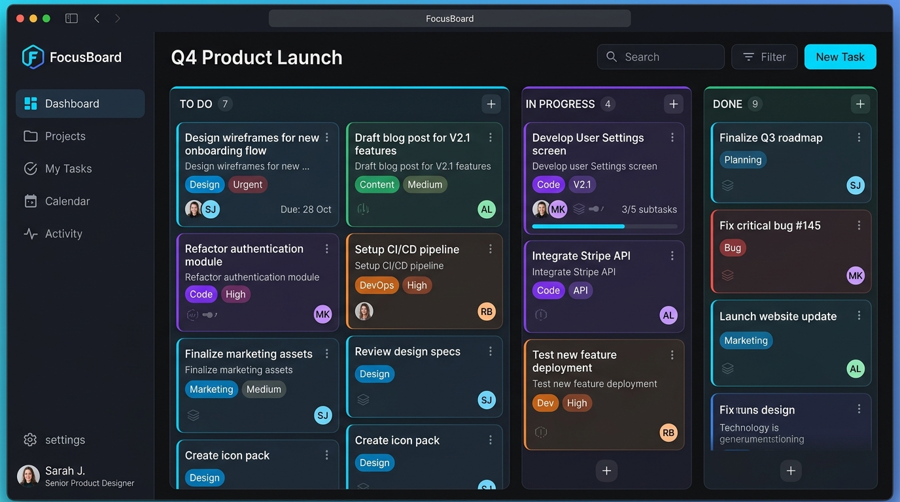
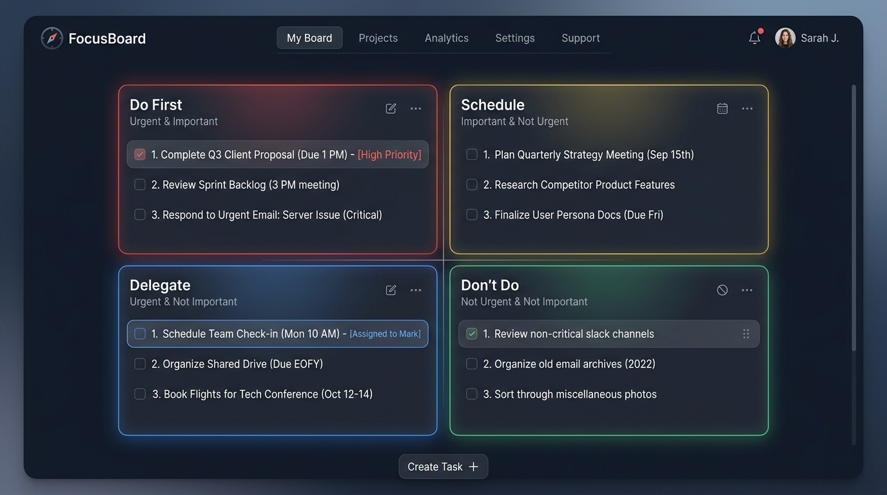
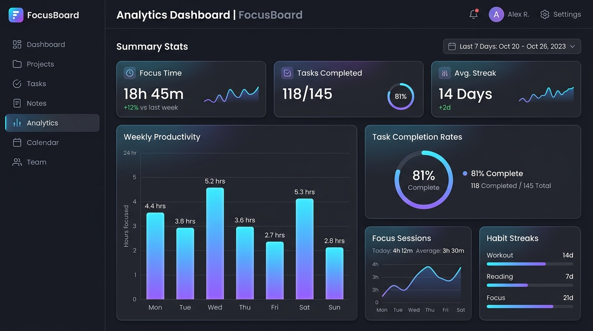
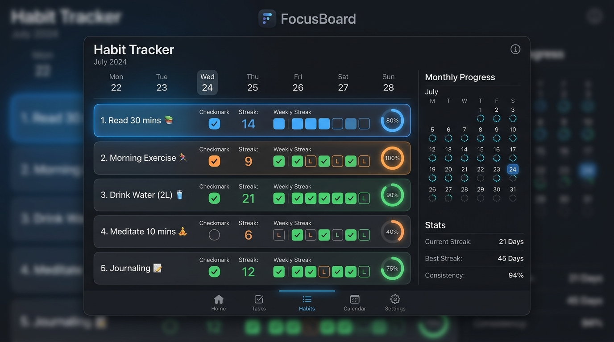

<h1 align="center">FocusBoard</h1>

<p align="center">
  <strong>A productivity app combining Kanban boards and the Eisenhower Matrix.</strong>
  <br/>
  <a href="https://flutter.dev" target="_blank"></a>
  <a href="https://dart.dev" target="_blank"></a>
  <a href="LICENSE"></a>
</p>

---

## ✨ Features

| Feature | Description |
|---|---|
| **📋 Kanban Board** | Drag-and-drop task management with swimlanes (To Do, In Progress, Done). |
| **📊 Eisenhower Matrix** | Prioritise tasks by urgency and importance (Eisenhower method). |
| **📈 Analytics** | Visual insights into your productivity trends and task completion. |
| **✅ Habit Tracker** | Track daily habits and build consistent routines. |
| **🌙 Dark / Light Theme** | Full theme support — light, dark, and customisable accent colours. |
| **🌍 Localisation** | Built with `intl` — ready for multiple languages. |

## 📸 Screenshots

| Kanban Board | Eisenhower Matrix |
|---|---|
|  |  |
| **Analytics Dashboard** | **Habit Tracker** |
|  |  |

## 🚀 Getting Started

### Prerequisites

- [Flutter](https://flutter.dev/docs/get-started/install) 3.5+
- [Dart](https://dart.dev/get-dart) 3.5+

### Installation

```bash
# Clone the repository
git clone https://github.com/shipblueprint/FocusBoard.git
cd FocusBoard/app

# Install dependencies
flutter pub get

# Run the app
flutter run
```

### Build

```bash
# Android
flutter build apk --debug
flutter build apk --release
flutter build appbundle --release   # Play Store

# iOS (macOS only)
flutter build ios --release

# Windows
flutter build windows --release
```

## 📦 Download & Install

### Windows

Pre-built Windows releases are available on the [Releases page](https://github.com/shipblueprint/FocusBoard/releases).

Download the latest `FocusBoard-windows-x64.zip`, extract it anywhere, and run `FocusBoard.exe`.

> **No installation required** — just unzip and run. The app is fully self-contained.

**To build from source:**
```bash
flutter build windows --release
# Output: build/windows/x64/runner/Release/
```


## 🧰 Tech Stack

| Tool | Purpose |
|---|---|
| [Flutter](https://flutter.dev) | Cross-platform UI framework |
| [Get](https://pub.dev/packages/get) | State management, routing, DI |
| [SharedPreferences](https://pub.dev/packages/shared_preferences) | Local persistence |
| [Google Fonts](https://pub.dev/packages/google_fonts) | Typography |
| [flutter_lucide](https://pub.dev/packages/flutter_lucide) | Premium icon set |
| [intl](https://pub.dev/packages/intl) | Internationalisation |
| [url_strategy](https://pub.dev/packages/url_strategy) | Web URL handling |

## Platforms

| Platform | Status |
|---|---|
| 📱 Android | ✅ Supported |
| 🍎 iOS | ✅ Supported (macOS build required) |
| 🪟 Windows | ✅ Supported (x86‑64) |
| 🌐 Web | ⏳ Experimental |

## 🤝 Contributing

Contributions are welcome! Please open an issue or submit a pull request.

1. Fork the project
2. Create your feature branch (`git checkout -b feature/amazing-feature`)
3. Commit your changes (`git commit -m 'Add amazing feature'`)
4. Push to the branch (`git push origin feature/amazing-feature`)
5. Open a Pull Request

## 📄 License

Distributed under the MIT License. See `LICENSE` for more information.

---

<div align="center">
  <sub>Built with ❤️ by <a href="https://github.com/shipblueprint">shipblueprint</a></sub>
</div>
